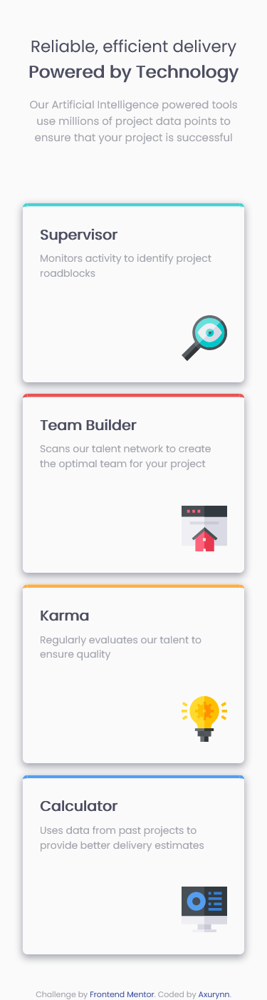

# Frontend Mentor - Four card feature section solution

This is a solution to the [Four card feature section challenge on Frontend Mentor](https://www.frontendmentor.io/challenges/four-card-feature-section-weK1eFYK). Frontend Mentor challenges help you improve your coding skills by building realistic projects.

## Table of contents

- [Overview](#overview)
  - [The challenge](#the-challenge)
  - [Screenshot](#screenshot)
- [My process](#my-process)
  - [Built with](#built-with)
  - [Useful resources](#useful-resources)
- [Author](#author)
- [Acknowledgments](#acknowledgments)

**Note: Delete this note and update the table of contents based on what sections you keep.**

## Overview

### The challenge

Users should be able to:

- View the optimal layout for the site depending on their device's screen size : mobile and/or desktop

### Screenshot

## My process

### Built with

- Semantic HTML5 markup
- CSS custom properties
- Flexbox
- Mobile-first workflow

### Useful resources

- [A guide to flexbox - css-tricks](https://css-tricks.com/snippets/css/a-guide-to-flexbox/) - This helped me for flexbox.

## Author

- Github - [Axurynn](https://github.com/Axurynn)
- Frontend Mentor - [Axurynn](https://www.frontendmentor.io/profile/Axurynn)

## Acknowledgments

Thanks [Baptjack](https://github.com/Baptajck) for helping me out !
